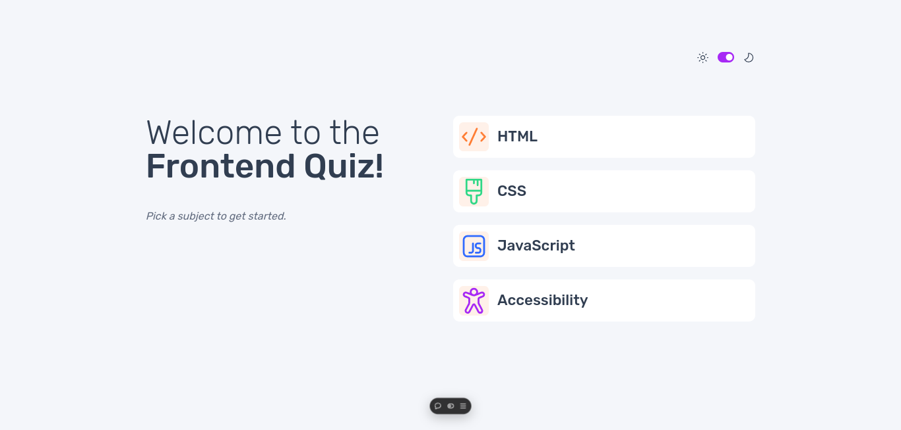

# Frontend Mentor - Frontend quiz app

This is a solution to the [Frontend Quiz App](https://www.frontendmentor.io/challenges/frontend-quiz-app-BE7xkzXQnU). Frontend Mentor challenges help you improve your coding skills by building realistic projects. 

## Welcome! 👋

Thanks for purchasing this premium Frontend Mentor coding challenge.

[Frontend Mentor](https://www.frontendmentor.io) challenges help you improve your coding skills by building realistic projects. These premium challenges are perfect portfolio pieces, so please feel free to use what you create in your portfolio to show others.

**To do this challenge, you need a strong understanding of HTML, CSS, and JavaScript.**

## Table of contents

- [Overview](#overview)
  - [The challenge](#the-challenge)
  - [Screenshot](#screenshot)
  - [Links](#links)
- [My process](#my-process)
  - [What I learn](#what-i-learn)
  - [Built with](#built-with)
  - [Useful resources](#useful-resources)
- [Author](#author)
- [Acknowledgments](#acknowledgments)

## Overview

### The challenge

Your challenge is to build out this quiz app and get it looking as close to the design as possible.

You can use any tools you like to help you complete the challenge. So if you've got something you'd like to practice, feel free to give it a go.

We provide the data in a local `data.json` file, so use that to populate the content for the quizzes.

Your users should be able to:

- Select a quiz subject
- Select a single answer from each question from a choice of four
- See an error message when trying to submit an answer without making a selection
- See if they have made a correct or incorrect choice when they submit an answer
- Move on to the next question after seeing the question result
- See a completed state with the score after the final question
- Play again to choose another subject
- View the optimal layout for the interface depending on their device's screen size
- See hover and focus states for all interactive elements on the page
- Navigate the entire app only using their keyboard
- Change the app's theme between light and dark

### Screenshot

### Links

- Solution URL: [GitHub repository](https://github.com/welpmoz/frontend-quiz-app).
- Live Site URL: [Live site](https://frontend-quiz-app-steel.vercel.app/)

## My process

### What I learn

- Learning a little bit using nextjs
- Adding states to react components
- Use ChatGPT for save time markuping with meaningful class names
- Integrate frontend with backend through API

### Built with

- Semantic HTML5 markup
- SASS
- NextJS
- React
- BEM methodology
- Git & GitHub
- Vercel
- Mobile first approach

### Useful resources

- [Responsively](https://responsively.app/): A best browser for develop responsive webs.
- [CSS examples](https://github.com/lsvekis/HTML-CSS-Exercises-Book): Simple but powerful examples that improve my CSS skills.
- [w3schools](https://www.w3schools.com): Great resource that provide several examples of HTML, CSS & JavaScript.
- [animation rocks](https://cssanimation.rocks/): Provide several innovative ideas for animate your project.
- [NextJS tutorial](https://nextjs.org/learn/dashboard-app): Very good and well structured tutorial for learn the nextjs basics.
- [Struturing SASS projects](https://www.youtube.com/watch?v=LVXUTvJnFYQ): An option for organize your sass projects.
- [Backend code](https://github.com/welpmoz/quizz-api): If you are interested, you can view my code build with FastAPI for provide the backend.

## Author

- Github - [Roswell Jaime](https://github.com/welpmoz)
- Frontend Mentor - [@welpmoz](https://www.frontendmentor.io/profile/welpmoz)

## Acknowledgments

I greatly appreciate the work done by the Frontend Mentor team. Their challenges are diverse and well-suited for developers at all levels. Additionally, I'm grateful for the inclusion of Figma as a useful resource.